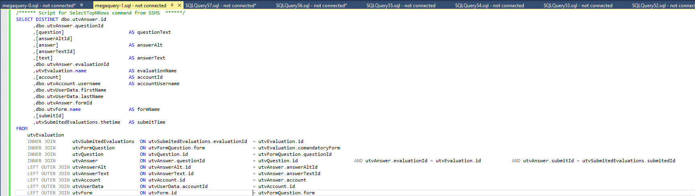
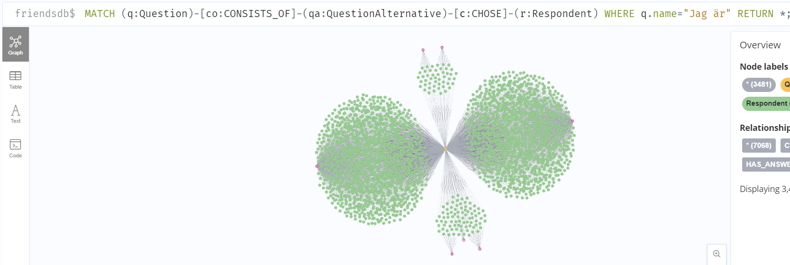

# Logbook Christoffer

## 2023-03-23



Did an SQL Query from the MSSQL database. This to export the data to a CSV file. The csv file is to be used to import the data into NEO4J.

## 2023-03-24

```python
import os
import pandas as pd

DATA_PATH = 'data/new_friends'

if os.path.exists(f'{DATA_PATH}.parquet'):
    print('Reading data from parquet file')
    data = pd.read_parquet(f'{DATA_PATH}.parquet')
elif os.path.exists(f'{DATA_PATH}.csv'):
    print('Reading data from csv file')
    with open(f'{DATA_PATH}.csv', 'r', encoding='utf-16', errors='ignore') as f:
        chunks = pd.read_csv(f, sep='®', engine='python', iterator=True, chunksize=1000000)
        data = pd.concat(chunk for chunk in chunks)
else:
    raise FileNotFoundError('No data file found')


print(data.head())
print(data.shape)

data.to_parquet(f'{DATA_PATH}.parquet')
```

Used the data from the CSV file to create a parquet file. This is to be used to import the data into NEO4J.

Had to clean up the data a whole ton. 20k rows where somehow added during the export from MSSQL to CSV.

Found a suitable delimiter for the CSV file: ®. This is a character that is not used in the data.

## 2023-03-27

Did some more cleaning of the data. The field `evaluationName` had handwritten text for school names in it. This was matched to a list of school names. The matched school names were added to a new column `school`.

Inspired by [Chris Moffitt](https://pbpython.com/text-cleaning.html) we managed to speed up the matching process from an estimated 19 days proccess time to an estimated 5 minutes proccess time by only working on unique values from the `evaluationName` field to later on merge the results back into the original dataframe.

```python
df = pd.read_parquet('data/friends.parquet')
lookup_df = pd.DataFrame()
lookup_df['evaluationName'] = df['evaluationName'].unique()
```

The matching was performed using a fuzzy match. The fuzzy match was performed using the [`TheFuzz`](https://github.com/seatgeek/thefuzz) library. The fuzzy match was performed using the `Partial Ratio` function. This function returns a score between 0 and 100. The score is the percentage of the string that matches. The score is calculated by comparing the string to a list of school names. The school names are sorted by the score. The school name with the highest score is returned.

## 2023-03-28

### Meeting with LNU

Had meeting with supervisor at LNU. Discussed the project and its plan for the future.

Notes:

```markdown

Method: How you plan to do it.

Focus on Neo4j, compare to other scientific work. Add table of comparison.

Problem formulation is reasearch questions and wh you want ,to do this work. Maybe motitivation, and examlpe on how this tool can help research. E.g. anti-bullying.

Scope and limitation. What is risk?

Tool is good. Bad data. How to classify it?

Time is of issue.

Motivation:

Visualization of data is important in any data scientific are.

Method:

Controlled experiment: Experimenting with specific tool.

Case study: Takeing data from friends and studying it on the tool, Neo4j.

Related work:

Are there other similar tools? If so then papers on those can be releveant. Else do works on Neo4j.
```

## 2023-03-29

### Meeting with Tietoevry

Had meeting with supervisors at Tietoevry. Discussed the project and its plan for the future.

Notes:

```markdown
Tidsplan kommer ändras

Motiviation kommer ändras

Bakgrund bra om den är spikad

Allt kan ändras

Välj ut populära frågor. Klassificera manueallt.

Conntrolled xperiment för neo4j. 

Case study för firnds som kund deras situation och analys av data. 

Fokus bör ligga på neo4j, dvs controlled experiment.

Jämförelse med python som referens/utgångspunkt.
```

### Previous resarch

Found some previous research on the topic of using graph databases for machine learning. The research is listed below.

[Implementation of Classification Algorithms in Neo4j using IPL data. Surajit Medhi, Hemanta K. Baruah](http://www.ijecs.in/index.php/ijecs/article/view/4635/4013)

[Machine Learning within a Graph Database: A Case Study on Link
Prediction for Scholarly Data.
Sepideh Sadat Sobhgol, Gabriel Campero Durand, Lutz Rauchhaupt
and Gunter Saake](https://www.scitepress.org/Papers/2021/103819/103819.pdf)

[Decision tree learning in Neo4j
on homogeneous and unconnected graph
nodes from biological and clinical datasets.
Rahul Mondal, Minh Dung Do, Nasim Uddin Ahmed, Daniel Walke, Daniel Micheel, David Broneske
Gunter Saake4 and Robert Heyer4](https://bmcmedinformdecismak.biomedcentral.com/counter/pdf/10.1186/s12911-023-02112-8.pdf)

### Explored Neo4J

Explored Neo4J. Tested various ml algorithms to see if they could be used in the project and further develop an understanding of the tool and how it is to be used in the project.

## 2023-03-31

### Literature review

Did a literature review on the topic of graph databases and machine learning. The literature review is listed below.

#### [Graph Data Science For Dummies V2](https://go.neo4j.com/rs/710-RRC-335/images/Graph%20Data%20Science%20For%20Dummies%20Neo4j%202nd%20Edition.pdf?_gl=1*12b2zlb*_ga*MjA2MzQwMjk1Ny4xNjc5NDA0MDM3*_ga_DL38Q8KGQC*MTY4MDE3Njg4My44LjEuMTY4MDE3Njk5Ny41OS4wLjA.)

##### Page 19

_Graph-native ML is an exciting area of research that represents
a new approach to ML that may drastically improve results with
less data, make predictions more explainable, and lead to new
types of learning itself. Most commonly, models are trained to
predict new or missing links — or relationships — that will form
in the graph or to predict new or missing labels for nodes. For
example, you could predict new relationships between fraudsters
and new victims to prevent fraud before it happens, or you could
predict missing labels for the customers that are most likely to
churn._

##### Page 20

_Graph-native learning enables whole-graph learning and multitask predictions that reduce data requirements and automate the
identification of relevant features. Today, the valuable time of data
scientists and domain experts is frequently employed to tediously
select and test potentially predictive data and collect those features into optimal models. Improving the model accuracy while
streamlining the process positively impacts ML processes and
results across all applications._

##### Page 25

Example on fraud detection using Neo4j.

#### Scientific papers found thorugh [towardsdatascience.com](https://towardsdatascience.com/introduction-to-machine-learning-with-graphs-f3e73c38d4f8)

#### [Representation Learning on Graphs: Methods and Applications William L. Hamilton Rex Ying Jure Leskovec](https://arxiv.org/pdf/1709.05584.pdf)

#### [Link Prediction Based on Graph Neural Networks Muhan Zhang Yixin Chen](https://papers.nips.cc/paper/2018/file/53f0d7c537d99b3824f0f99d62ea2428-Paper.pdf)

### Wrote project plan

Wrote a project plan for the project. The project plan is hosted on [Overleaf](https://www.overleaf.com/project/6422d3d2988b5351762c68d1).

## 2023-04-03

### Peer review

Did a peer review of the project plan of another student. The peer review is hosten on the Friends team OneDrive.

### Restructure of Neo4j

Restructured the Neo4j database. Some nodes weren't connected to the correct nodes. The database was restructured to make it easier to query the database. Olof saved the some images and queries used for the restructuring of the database.

## 2023-04-04

### Studied related works

Studied related works on the topic of graph databases and machine learning. A good one that might be used is [GRAPH DATA SCIENCE; USE CASES: FRAUD AND; ANOMALY DETECTION](https://go.neo4j.com/rs/710-RRC-335/images/Graph-Data-Science-Use-Cases-Fraud-and-Anomaly-Detection-EN-US.pdf?_gl=1*hxpb04*_ga*MjA2MzQwMjk1Ny4xNjc5NDA0MDM3*_ga_DL38Q8KGQC*MTY4MDYwNzk0Mi4xNi4xLjE2ODA2MDkxMjMuNjAuMC4w)

### Studied Neo4j

#### Query Respondents Answers for specific Question

Tried to query the database to get the answers to a specific question. The query is listed below.

```sql
MATCH (q:Question)-[co:CONSISTS_OF]-(qa:QuestionAlternative)-[c:CHOSE]-(r:Respondent)
WHERE q.name="Jag är"
RETURN *;
```



The graph is represented nicer in Neo4j Browser compared to Neo4j Bloom.

#### Tested algorithms within Neo4j Bloom

Tested all algroithms within Neo4j Bloom. The query tested was:

```sql
Cypher query: MATCH (su:Survey)-[ha:HAS_QUESTION]-(qu:Question)-[co:CONSISTS_OF]-(qa:QuestionAlternative)-[ch:CHOSE]-(re:Respondent) WHERE su.name="Elevenkät åk 4-6 pilot" RETURN *;
```

The algorithms are listed below.

- PageRank
  - Centrality algorithms like PageRank can be used to find anomalies by scoring accounts based on their transaction behaviors; outliers with oversized impact.
on your transaction networks may be fraud kingpins.
- Louvain
  - Algorithms like Louvain are widely used to identify fraud rings by finding suspicious transaction patterns.
- Label Propagation
  - No results
- K-Core
- Degree Centrality
- Betweenness Centrality
- Community Detection
- Connected Components
  - Community detection algorithms like Weakly Connected Components can be run to identify first party fraud where users share identifiers such as IP addresses or social security numbers.
- Shortest Path

#### Meeting with Aslan

Had meeting with Aslan. He said that our idea to write how to structure data for optimal ML was a good idea on the case study part of the report. 

He also said that the report should take about 3 weeks to finish. 

We should start writing chapter 1-3 next week.

Below are the meeting notes:

```text
- Runt 3 veckor för rapporten
- En liten sektion om hur datan har strukturerats. Typ när vi nämnar Friends som Case study.
- Börja skriva kapitel 1.
```
